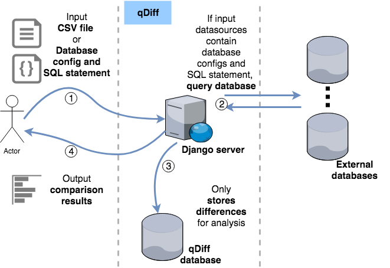
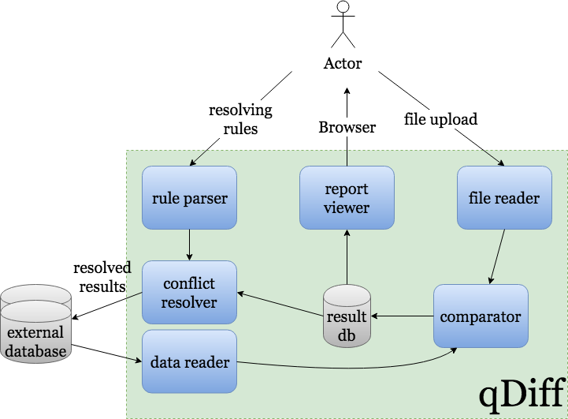
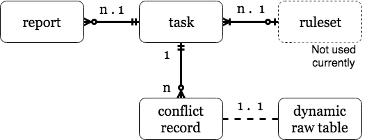

# qDiff
## Overview
A tool for finding the difference between multiple data sources which should have the same value.

---
## Goals
1. Reduce the efforts required to check data validation from different source.
1. Report the differences to user.
1. Resolve the differences for user basing on input rules.

---
## System architecture
### Architecture

    For database, the user should config access in qDiff database.
    For API, the user should input an description for the API, including endpoint, method, parameters, and authentication information.


<a href="https://drive.google.com/open?id=1GzHV_wweiGHNRarZlgLIKfL8TgOqlY5i">link</a>

### Data flow

<a href="https://drive.google.com/open?id=1rTqiyL6w3TEEVXfZsxA1inN8pERg8vrF">link</a>


### Components
1. Data reader
    * Using ORM framework to read the data
    * Supporting multiple databases and file sources
1. file reader
    * Importing the file into the database, support  DSV(CSV, TSV) and excel
1. Comparator
    
    1. Brief description

        data1, data2: the input data, can be queryset, list, dictionary

        item1, item2: the elements from data1 and data2
        
        list1, list2: the list for saving unmatch records

    1. steps
        1. Sort the data1 and data2
        1. Iterate over data1 and data2 at same time, item1 comes from data1 and item2 comes from data2
            1. If the item1 is identical to item2, iterate next item
            1. If the item1 in list2, save the all elements in list2 except item1 as conflicted results
            1. If the item2 in list1, save the all elements in list1 except item2 as conflicted results
            1. If the item1 is different from the item2, put item1 in list1 and item2 in list2

    1. Complexity.

        given m,n = len(data1),len(data2)
    
        Time complexity:

            Average Case: O(m+n)

            Amortized Worst Case: O(m*n)

        Space complexity:

            O(m+n)

    1. pseudo code in python

        ```python
        qDiff(data1, data2):
            iter1 = iter(sorted(data1))
            iter2 = iter(sorted(data2))
            temp_dict1 ={}
            temp_dict2 ={}
            item1 = None
            item2 = None
            try:
                while True:
                    item1 = next(iter1)
                    item2 = next(iter2)
                    h1 = hash(item1)
                    h2 = hash(item2)
                    if h1==h2:
                        item1 = None
                        item2 = None
                        continue
                    elif h1 in temp_dict2 or h2 in temp_dict1:
                        if h1 in temp_dict2:
                            temp_dict2.pop(h1)
                            saveToConflictedResult(temp_dict2.values())
                        if h2 in temp_dict1:
                            temp_dict1.pop(h2) 
                            saveToConflictedResult(temp_dict1.values())
                    else:
                        temp_dict1[h1]=item1
                        temp_dict2[h2]=item2
                    item1 = None
                    item2 = None
            except StopIteration as e:
                if not item1:
                    saveToConflictedResult(list(iter2))
                else:
                    saveToConflictedResult([item1] + list(iter1))
        ```


1. Rule parser
    * Parsing the input rules and save as rule set for reuse
    * Rules:

        Where to write the resolved result
        Left join, right join, inner join, and outer join
        Condition based rule, (E.X. when field1 == 0 and field2 > 3)


1. Report viewer
    * Providing the comparison result    
    * GUI for accepting rules for resolving (phase 3)

1. Conflict resolver
    * Filtering the conflicted results basing on the input rules


---
## Scenarios
1. Comparing tables within same database
1. Comparing tables from different databases
1. Comparing tables with different range of data within same/different database
1. Comparing table and CSV file
1. Comparing unordered CSV file and database 

---

## Milestone
### Development
| phase | timeline | items
---|---|---
1 | Week 2 | Data reader, file reader, comparator
2 | Week 4 | Report viewer
3 | Week 6 | Rule parser, conflict resolver

### SIT
| phase | timeline | items
---|---|---
1 | Week 3 | Data reader, file reader, comparator
2 | Week 5 | Report viewer
3 | Week 7 | Rule parser, conflict resolver

### CAT/UAT
| phase | timeline | items
---|---|---
1 | Week 4 | Data reader, file reader, comparator
2 | Week 6 | Report viewer
3 | Week 8 | Rule parser, conflict resolver

---

## ERD
### entities	

1. Task

    * Information of datasource
    * Uploaded file path
    * Database information (encryption required, use what as secret key, what as salt) 
    * Datetime, Recording the start time and end time for performance evaluation
    * Owner 

1. Conflict record
    * Raw data
    * What source it belongs to
1. Rule set
    * Name 
    * Description
    * Rule, formatted rules in json format
    
